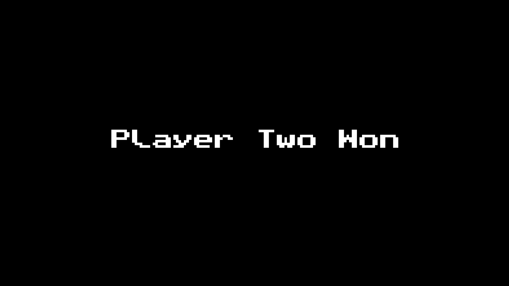

# Pong

## Usage
quick note: this code is only tested on linux, im 99% sure it will work on other platforms if you have clang++ and sfml installed but still im not sure.

- of course you need to have SFML installed in order to compile the program
	* To install sfml on a Debian based machine use `sudo apt-get install libsfml-dev`
	* To install sfml on a ArchBtw based machine use `sudo pacman -S sfml`

- also on some systems you may need to install clang/clang++ yourself
	* on Debian based machine you can use `sudo apt-get install clang`
	* on ArchBtw based machine you can use `sudo pacman -S clang`

- In the root directory use `make` or `make main` to compile the program.  This will create a `./main` executable in the bin directory of the project.
	* To run the program, use either `make` or `./bin/pong` on the directory of the project.
	* To remove the program, use `make clean` or just `rm ./bin/pong`.

## Controls
##### Player 1
* `W` - Move up
* `S` - Move down

##### Player 2
* `UP KEY` - Move up
* `DOWN KEY` - Move down

## TODO
- [ ] add sound 
- [ ] add splashscreen
- [ ] add an option to use ai or to play multiplayer
